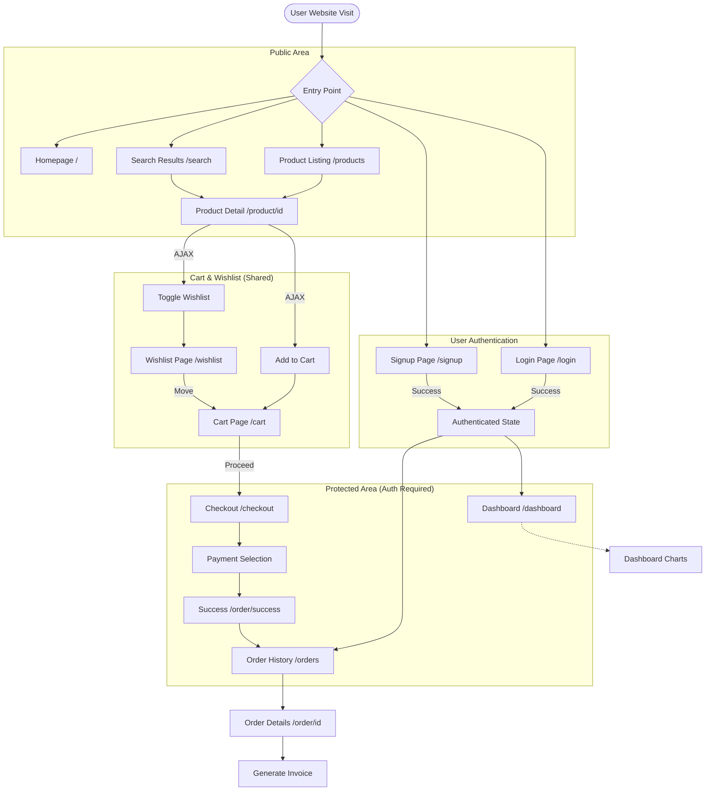
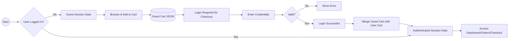
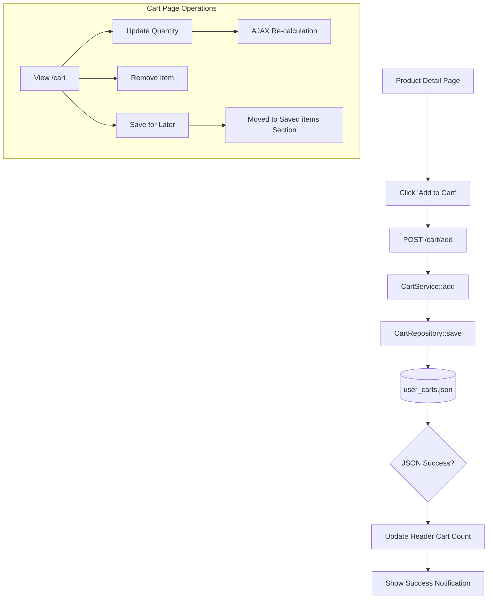
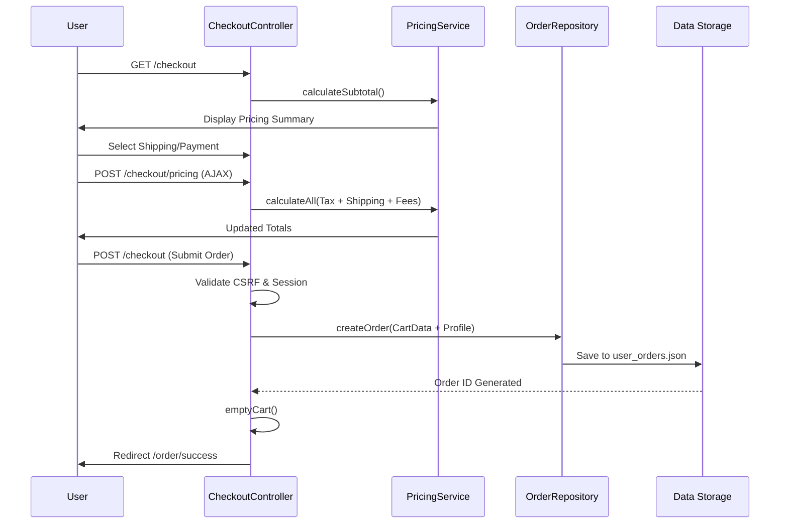
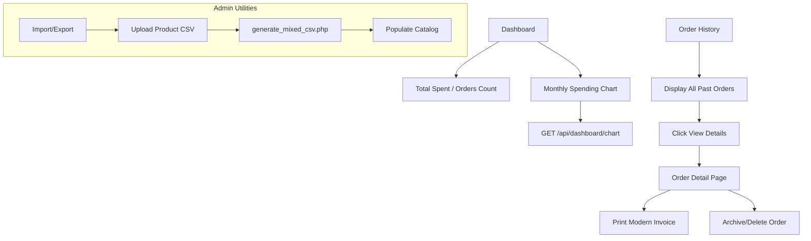

# 🗺️ EasyCart E-Commerce: Full Project Flowchart

This document provides a comprehensive visual representation of the user journey, data states, and application transitions within the EasyCart system.

## 1. High-Level System Architecture

---

## 2. Detailed Interaction & State Logic

### A. Authentication & Session Flow
This flow describes how user data (especially the Cart) transitions between a Guest state and an Authenticated state.

### B. Add to Cart & Management Flow (AJAX)
Every item interaction happens asynchronously without page reloads for a premium UX.

### C. Checkout & Order Processing
The most complex logic path involving pricing, validation, and finalization.

### D. User Dashboard & Order Management
The personal space for users to manage their history.

---

## 3. Data Flow Overview (Technical)

| Trigger | Component | Logic Handler | Storage Target |
| :--- | :--- | :--- | :--- |
| **Search** | `ProductController` | `ProductRepository::search()` | `products.json` |
| **Login** | `AuthController` | `AuthService::login()` | `users.json` |
| **Add Product** | `CartController` | `CartService::add()` | `user_carts.json` |
| **Pay/Finalize** | `CheckoutController` | `PricingService` | `user_orders.json` |
| **Dashboard** | `DashboardController` | `FormatHelper` | Aggregated JSON Data |
