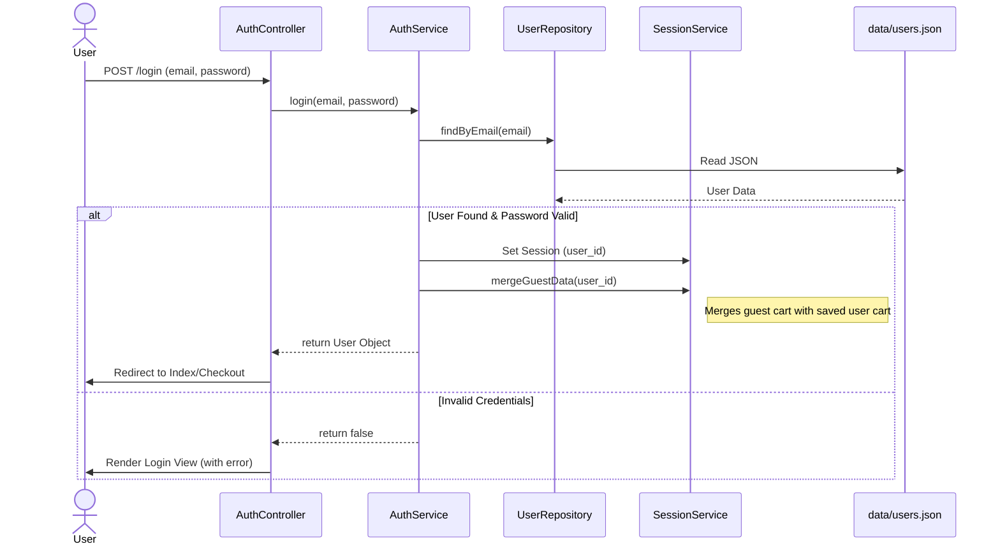
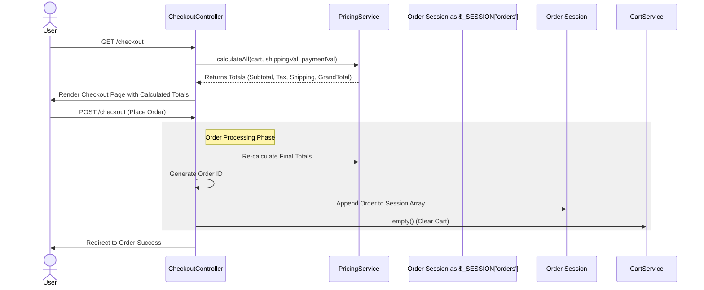

# EasyCart System Architecture & Design

> [!IMPORTANT]
> This document details the implementation of EasyCart as of Phase 4. It covers architecture, workflows, data schemas, and component interactions.

## 1. Architectural Overview

EasyCart implements a strict **MVC (Model-View-Controller)** pattern with a **Front Controller** entry point. It utilizes a **Service Layer** pattern to encapsulate business logic, keeping Controllers "skinny". Data persistence involves a hybrid approach using **JSON Flat-Files** and **PHP Sessions**.

### 1.1 High-Level Component Diagram

```mermaid
graph TD
    User((User)) -->|HTTP Request| FrontController[public/index.php]
    
    subgraph "Application Layer (MVC)"
        FrontController --> Router{Routing Logic}
        Router -->|Dispatch| Controllers
        
        subgraph Controllers
            HomeController
            ProductController
            CartController
            CheckoutController
            AuthController
        end
        
        Controllers -->|Use| Services
        
        subgraph Services
            CartService
            AuthService
            PricingService
            CouponService
        end
        
        Services -->|Read/Write| Repositories
        
        subgraph Repositories
            ProductRepository
            CartRepository[CartRepository (Hybrid)]
            UserRepository
            SaveForLaterRepository
        end
    end
    
    subgraph "Data Layer"
        Config[config/constants.php]
        JSON[data/*.json]
        Session[PHP Session]
    end
    
    Repositories -->|Read Static Data| Config
    Repositories -->|Read/Write Persistent| JSON
    Repositories -->|Read/Write Volatile| Session
    
    Controllers -->|Render| Views[App Views]
    Views -->|Response| User
```

## 2. Directory Structure & Responsibilities

```text
d:/Cybercom Creation/EasyCart E-Commerce/
├── app/
│   ├── Controllers/       # Handle incoming requests, input validation, logic dispatch
│   │   ├── AuthController.php      # Login, Signup, Logout
│   │   ├── CartController.php      # Add/Remove/Update cart items
│   │   ├── CheckoutController.php  # Pricing calc, Order processing
│   │   └── ...
│   ├── Services/          # Pure Business Logic (Reusable, Framework agnostic)
│   │   ├── AuthService.php         # User validation, Session management
│   │   ├── CartService.php         # Cart rules, stock checks
│   │   ├── PricingService.php      # Tax, Shipping, Totals calculation
│   │   └── ...
│   ├── Repositories/      # Data Access Layer (Abstraction over JSON/Session)
│   │   ├── CartRepository.php      # Handles Hybrid Session/File storage
│   │   ├── UserRepository.php      # CRUD for users.json
│   │   └── ...
│   ├── Views/             # Presentation Layer (PHP Templates)
│   └── Helpers/           # Static utilities (e.g., FormatHelper::price)
├── config/
│   ├── constants.php      # Static "Database" for Products/Categories
│   └── app.php            # Global settings
├── data/                  # Flat-File Database
│   ├── users.json         # Persistent User Storage
│   └── user_carts.json    # Persistent Cart Storage
├── public/
│   ├── index.php          # Front Controller & Router
│   └── assets/            # Static Assets (CSS, JS)
└── vendor/                # Dependency Manager (Composer)
```

## 3. Key Workflows & Data Flows

### 3.1 Authentication Flow (Login)
This workflow demonstrates how the system validates users and merges guest data (like cart items) upon successful login.



### 3.2 Shopping Cart Architecture (Hybrid Persistence)
The cart system handles two states: **Guest** and **Logged-In**.

*   **Guest**: Logic is isolated to `$_SESSION['guest_cart']`. Data is volatile.
*   **Logged-In**: Logic uses `$_SESSION['cart']` but **synchronizes** to `data/user_carts.json` via `CartRepository->saveToDisk()`.

**Data Flow:**
1.  `CartController` receives input (Product ID, Qty).
2.  `CartService` validates stock (from `ProductRepository`).
3.  `CartService` calls `CartRepository->save($cart)`.
4.  `CartRepository` checks `$_SESSION['user_id']`.
    *   **If Set**: Update `$_SESSION['cart']` **AND** write to `data/user_carts.json`.
    *   **If Null**: Update `$_SESSION['guest_cart']` only.

### 3.3 Checkout & Order Processing
The checkout process involves real-time pricing calculation and order generation. Note that Orders are currently **Session-Based** only.



## 4. Data Models & Schemas

The system relies on structured JSON files for persistence. Below are the schemas used.

### 4.1 Users (`data/users.json`)
Hash-map keyed by User ID.
```json
{
  "1": {
    "id": 1,
    "email": "talat@example.com",
    "password": "$2y$10$hashed_password_string...",
    "name": "Talat",
    "created_at": "2026-01-30"
  }
}
```

### 4.2 Persisted Carts (`data/user_carts.json`)
Stores the cart state for logged-in users to ensure cross-device persistence.
```json
{
  "1": { // Key is User ID
    "101": 2, // "ProductID": Quantity
    "105": 1
  },
  "2": {
    "203": 5
  }
}
```

### 4.3 Orders (Session Memory)
Orders are currently stored in `$_SESSION['orders']` and are **not persisted to disk**.
```php
$_SESSION['orders'] = [
    1 => [ // User ID
        [
            'id' => 'ORD-ABC12345',
            'date' => 'February 2, 2026',
            'items' => [
                ['product_id' => 101, 'name' => 'Laptop', 'price' => 999, 'quantity' => 1]
            ],
            'total' => 1050.00,
            'status' => 'Processing'
        ]
    ]
];
```

## 5. Security Measures
1.  **Password Hashing**: `password_hash()` and `password_verify()` (Bcrypt).
2.  **Input Sanitation**: Basic validation in Controllers.
3.  **Session Isolation**: Guest and User data are kept in separate session keys until merge.
4.  **Access Control**: Middleware-like checks (`AuthService::check()`) at the start of protected Controller methods (`process`, `pricing`).
