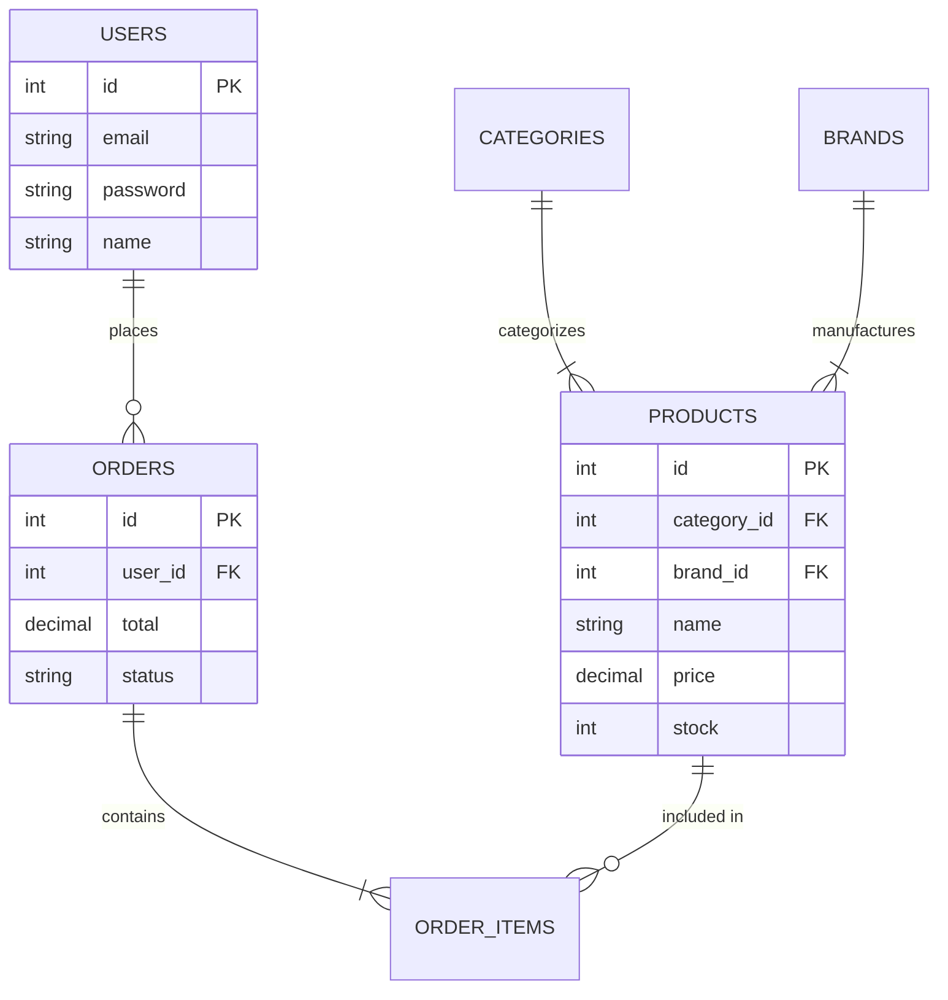

# PostgreSQL Migration Plan (Phase 6)

## Executive Summary
This plan covers the migration of EasyCart from a Flat-File/Session persistence layer to a relational PostgreSQL database. This will improve data integrity, scalability, and enable advanced querying capabilities.

**Estimated Time**: ~10 Hours

## 1. Database Schema Design (New)

We will introduce a distinct `app/Core/Database.php` singleton for handling PDO connections.

### Entities & Tables
1.  **Users** (`users`)
    *   `id` (SERIAL PRIMARY KEY)
    *   `email` (VARCHAR UNIQUE)
    *   `password` (VARCHAR)
    *   `name` (VARCHAR)
    *   `created_at` (TIMESTAMP)

2.  **Categories** (`categories`)
    *   `id` (SERIAL PRIMARY KEY)
    *   `name` (VARCHAR)
    *   `slug` (VARCHAR)

3.  **Brands** (`brands`)
    *   `id` (SERIAL PRIMARY KEY)
    *   `name` (VARCHAR)

4.  **Products** (`products`)
    *   `id` (SERIAL PRIMARY KEY)
    *   `category_id` (INT FK -> categories)
    *   `brand_id` (INT FK -> brands)
    *   `name` (VARCHAR)
    *   `slug` (VARCHAR)
    *   `price` (DECIMAL)
    *   `stock` (INT)
    *   `description` (TEXT)
    *   `image` (VARCHAR)
    *   `is_featured` (BOOLEAN)
    *   `is_new` (BOOLEAN)

5.  **Orders** (`orders`)
    *   `id` (SERIAL PRIMARY KEY) - *Note: current system uses string IDs like 'ORD-XYZ', might switch to or map to Int ID*
    *   `order_number` (VARCHAR UNIQUE)
    *   `user_id` (INT FK -> users)
    *   `subtotal` (DECIMAL)
    *   `shipping_cost` (DECIMAL)
    *   `tax` (DECIMAL)
    *   `total` (DECIMAL)
    *   `status` (VARCHAR)
    *   `created_at` (TIMESTAMP)

6.  **Order Items** (`order_items`)
    *   `id` (SERIAL PRIMARY KEY)
    *   `order_id` (INT FK -> orders)
    *   `product_id` (INT FK -> products)
    *   `quantity` (INT)
    *   `price` (DECIMAL) - *Snapshot of price at purchase*

### Entity Relationship Diagram

> [!NOTE]
> **Automated Data Migration**: You currently have ~500 products in `products.json`. **You do NOT need to insert these manually.**
> We will create a script (`scripts/migrate_products.php`) that automatically:
> 1. Reads your existing JSON file.
> 2. Connects to the new PostgreSQL database.
> 3. Inserts all 500+ records in seconds.
> This ensures no data is lost and saves you hours of manual work.

## 2. Migration Strategy (What needs to change)

| Component | Current State | Target State (PostgreSQL) |
| :--- | :--- | :--- |
| **Config** | `data/*.json`, `config/constants.php` | `config/database.php` (Credentials) |
| **Products** | `ProductRepository` reads `products.json` | `ProductRepository` calls SQL `SELECT * FROM products` |
| **Images** | JSON has `images` array | **Schema**: `image (VARCHAR)`. **Migration Logic**: Assign 1 representative image per Brand. All products of Brand X get Image X. |
| **Categories**| `CategoryRepository` uses static array | `CategoryRepository` calls `SELECT * FROM categories` |
| **Brands** | `BrandRepository` uses static array | `BrandRepository` calls `SELECT * FROM brands` |
| **Users** | `UserRepository` reads `users.json` | `UserRepository` uses `INSERT/SELECT` on `users` table |
| **Orders** | `$_SESSION['orders']` (Volatile) | New `OrderRepository` writes to `orders` & `order_items` tables |
| **Cart** | `user_carts.json` + Session | *Hybrid approach recommended*: Keep Session for guest, maybe DB for logged user, or stick to JSON/Hybrid for now to reduce scope. Plan focuses on core entities first. |

## 3. Implementation Steps

1.  **Infrastructure (1 Hour)**
    *   Install `vlucas/phpdotenv` (optional) or create `config/database.php`.
    *   Create `app/Core/Database.php` helper class.
    *   Create `schema.sql`.

2.  **Data Migration Scripts (2 Hours)**
    *   Create `scripts/migrate_products.php`: 
        *   Reads `products.json`.
        *   **Image Logic**: Group products by Brand. Pick the first image found for that Brand. Apply this single image path to ALL products of that Brand in the DB.
        *   Inserts to DB.
    *   Create `scripts/migrate_users.php`: Reads `users.json` -> Inserts to DB.
    *   Create `scripts/seed_static.php`: Seeds Categories and Brands.

3.  **Repository Refactoring (4-5 Hours)**
    *   Refactor `CategoryRepository` & `BrandRepository` (Simple reads).
    *   Refactor `ProductRepository` (Filtering logic needs SQL `WHERE` clauses).
    *   Refactor `UserRepository` (Auth logic).
    *   **New**: Create `OrderRepository` to handle transactional order creation.

4.  **Integration & Testing (2 Hours)**
    *   Verify Frontend still loads products (Abstracted by Repository, so Controller/View changes should be minimal).
    *   Test Checkout Flow (Crucial: Order creation).
    *   Test Login/Signup.

## 4. Verification Plan

### Automated Tests
*   We can create a simple PHP script `tests/db_test.php` to verify connection and basic queries.

### Manual Verification
1.  **Browse**: Ensure Product Listing page loads from DB.
2.  **Filter**: Test Category/Price filters (ensure SQL `WHERE` logic works).
3.  **Auth**: Signup a new user, checks DB. Login.
4.  **Checkout**: Place an order. Check `orders` table for new record.
